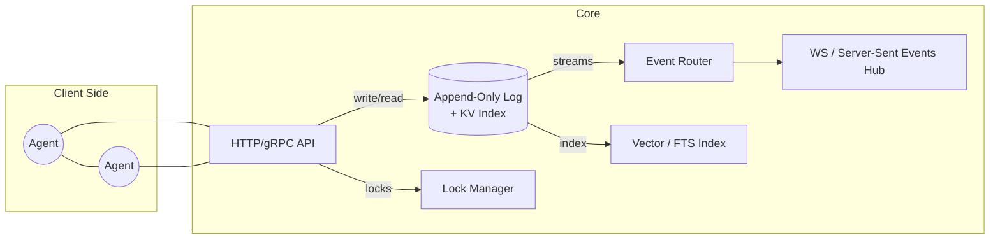
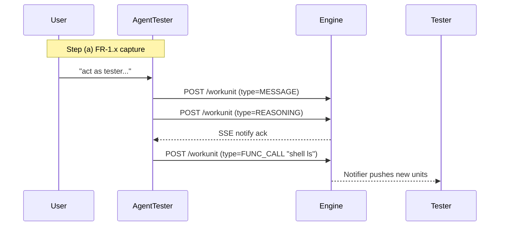

# Technical Specification
## Real-Time Multi-Agent Collaboration Engine

---

### 0 . Document Purpose
This tech-spec translates the **functional spec** and the **sample interaction transcripts** into an actionable design that engineers can implement. It covers architecture, data-models, APIs, component responsibilities, sequencing, and operational concerns.

---

### 1 . Goals & Non-Goals
**Goals**
1. Ultra-low-latency (< 5 ms local) capture, store, query, and stream of "Work Units".
2. Deterministic context grouping and real-time fan-out to interested agents.
3. Pluggable locking / concurrency management for shared artifacts.
4. Single-node first; horizontally partitionable later.

**Non-Goals**
• Agent reasoning logic, LLM orchestration, or tool-specific adapters.
• Long-term archival/analytics (beyond export hooks).

---

### 2 . Key Concepts (Glossary)
| Term | Description | Source FR |
|------|-------------|-----------|
| WorkUnit | Immutable atomic record (message, tool output, code diff, etc.). | FR-1.x |
| Context | Dynamic collection of WorkUnits + participating Agents. | FR-2.x |
| Relationship | Typed edge between WorkUnits (`SEQUENTIAL`, `CAUSES`, …). | FR-1.5 |
| Subscription | Push channel where an Agent gets event notifications. | FR-3.x |
| LockHandle | Time-boxed exclusive right on a resource path. | FR-4.x |

---

### 3 . High-Level Architecture



• **Single binary** with modules above.
• Internal bus is an _in-memory event queue_ (RingBuffer) to minimise GC latency.
• Persistence layer = write-ahead log (WAL) + RocksDB KV slabs.

---

### 4 . Data Model

```protobuf
message WorkUnit {
  string id             = 1;  // UUIDv7
  string context_id     = 2;
  string agent_id       = 3;  // "user", "system", or agent UUID
  WorkUnitType type     = 4;
  google.protobuf.Timestamp ts = 5;
  map<string,string> meta = 6;
  bytes payload         = 7;  // UTF-8 or binary blob
  repeated string rel_refs = 8; // WorkUnit IDs
}

message Context {
  string id                   = 1;
  string display_name         = 2;
  repeated string agent_ids   = 3;
  repeated string pinned_unit = 4; // always-load list
}

message LockHandle {
  string resource_path = 1;   // e.g. "repo/README.md"
  string holder_agent  = 2;
  google.protobuf.Timestamp expires_at = 3;
}
```

Indexes:
• `(context_id, ts)` ordered index for chron retrieval.
• `meta.*` inverted index for filter queries.
• `embedding` Vector index (optional plugin) for semantic FR-5.1-(a).

---

### 5 . API Surface

| Area | Method | Notes |
|------|--------|-------|
| Capture | `POST /workunit` | ≤ 1 KB payload path is critical for 1 ms target. Bulk endpoint available. |
| Context | `PATCH /contexts/{id}` | Add/Remove agents, pin/unpin workunits. |
| Stream  | `GET /stream?context={id}` (SSE/WS) | Heartbeat 5 s, replay cursor param. |
| Locks   | `POST /locks` / `DELETE /locks/{resource}` | 409 if held. TTL required. |
| Search  | `POST /search` | Hybrid BM25 + vector. Returns IDs then separate `GET /workunit/{id}` batch fetch. |

Authentication header carries `agent_id` (JWT in prod).

---

### 6 . Component Details

#### 6.1 API Gateway
• Go / Rust HTTP stack with `SO_REUSEPORT` for multi-thread.
• Bypasses JSON parsing on hot-path writes (Protobuf over HTTP).

#### 6.2 Storage
| File | Purpose |
|------|---------|
| `wal.log` | Append-only, fsync per batch (N=64 units or 2 ms).
| `kv.db`  | RocksDB column families: primary, meta index, context map.

Recover sequence = replay WAL → rebuild missing CF index → serve.

#### 6.3 Router & Notifier
• Each new WorkUnit enqueues `(context_id, serialized)` onto a lock-free ring.
• Subscriptions store a cursor; fan-out uses **topic per context**.
• Idle connections dropped after 30 s. Re-attach with last seen seq. id.

#### 6.4 Lock Manager
• In-memory map `{resource: LockHandle}` guarded by RW-mutex.
• State mirrored in KV for crash recovery (leases expire after ttl).
• Deadlock prevention: enforce lexical ordering of multiple lock requests.

#### 6.5 Search Index
Pluggable: start with SQLite FTS5; later switch to Qdrant for vector search. Index receives async updates via WAL tailer.

---

### 7 . Key Sequences

#### 7.1 "Tester writes tests" (Conversation-1)



(Lock acquisition shown in sequence 7 . 2 when file edits are made.)

---

### 8 . Performance Budget
| Operation | Target | Strategy |
|-----------|--------|----------|
| Single WorkUnit write | ≤ 1 ms p99 | in-mem ring + batched fsync |
| Stream fan-out latency | ≤ 5 ms end-to-end | zero-copy broadcast buffers |
| Query last 100 units | ≤ 2 ms | KV CF `context_ts` index |

---

### 9 . Operational Concerns
• **Health Checks**: `/healthz` (process), `/readyz` (storage recover complete).
• **Metrics**: Prometheus—write latency, queue depth, SSE subscribers.
• **Tracing**: OpenTelemetry spans per WorkUnit path.
• **Config**: `YAML` file + env overrides.
• **Backup**: WAL shipped to S3 every 5 s window.

---

### 10 . Testing Strategy
1. **Unit**: codec, locking edge cases.
2. **Integration**: spin-up engine, issue 10 k writes, assert ordering.
3. **Contract Tests**: protobuf schema lint + backward compatibility CI.
4. **Benchmarks**: `go test -bench ./...` measuring latency targets.

---

### 11 . Incremental Delivery Plan
| Milestone | Scope | Exit Criteria |
|-----------|-------|---------------|
| 0. Scaffold | Repo, CI, proto definitions | Lint/Unit tests passing |
| 1. Core Write & Query | WAL, KV, `/workunit` R/W | p95 < 2 ms in local bench |
| 2. Streaming | Router, SSE hub, Subscriptions | Fan-out demo with 2 agents |
| 3. Contexts & Locks | Full FR-2, FR-4 coverage | Integration tests green |
| 4. Search | Meta filters + BM25 | Query acceptance tests |
| 5. Alpha Tag | README, Dockerfile, examples | Project review sign-off |

---

### 12 . Open Questions / Future Work
* How to shard Contexts across nodes (consistent-hash ring vs. sticky sessions)?
* Embedding model choice & update cadence.
* Multi-tenant auth/ZT security.


**Functional Specification: Multi-Agent Collaborative Work Orchestration System**

**1. Purpose & Goal:**

To provide a foundational system that enables multiple, potentially specialized, automated agents to collaborate effectively and efficiently in real-time on complex tasks, particularly those involving software development, tool usage, and information synthesis. The system must act as a shared workspace, communication bus, and short-term/long-term memory, prioritizing extremely low latency for interactions and state synchronization.

**2. Scope:**

This specification covers the functional requirements for the core engine that facilitates agent interaction, information capture, context management, and coordination. It does *not* define the specific logic or capabilities of the individual agents themselves, only the environment they operate within.

**3. Users / Actors:**

*   **Automated Agents:** Software entities performing tasks (e.g., coding, reviewing, testing, planning). They are the primary interactors.
*   **System:** The orchestration engine itself.
*   **Human Overseer:** May interact to monitor, configure, or query the system state and agent activities.

**4. Core Functional Requirements:**

**4.1. Information Capture & Representation:**

*   **FR-1.1:** The system **MUST** capture discrete units of information or work generated or observed by agents. These units include, but are not limited to:
    *   Conversation messages (user-to-agent, agent-to-agent, agent-to-system)
    *   Agent decisions or reasoning steps
    *   Instructions given to tools or other agents
    *   Outputs received from tools
    *   Modifications to shared artifacts (e.g., code changes, document edits)
    *   Task status updates
*   **FR-1.2:** Each captured work unit **MUST** be associated with its originating agent (or user/system).
*   **FR-1.3:** Each captured work unit **MUST** be timestamped upon creation or capture.
*   **FR-1.4:** The system **MUST** allow associating arbitrary, relevant metadata with each work unit (e.g., tool name, confidence score, file path, task ID).
*   **FR-1.5:** The system **MUST** allow establishing explicit, typed relationships between work units (e.g., sequential order, causal links, dependencies, references).
*   **FR-1.6:** The chronological sequence of work units within a specific activity stream (e.g., a conversation, a tool use cycle) **MUST** be preserved and retrievable.

**4.2. Context Management:**

*   **FR-2.1:** The system **MUST** allow grouping related work units and participating agents into logical "Contexts" (representing, e.g., an active task, project workspace, debugging session).
*   **FR-2.2:** Agents **MUST** be able to retrieve the set of work units currently defined as relevant within one or more specific Contexts.
*   **FR-2.3:** Agents **MUST** be able to determine which other agents are currently associated with a specific Context.
*   **FR-2.4:** The system **MUST** allow for dynamic modification of Contexts (adding/removing work units, adding/removing agents).

**4.3. Real-time Communication & Awareness:**

*   **FR-3.1:** The system **MUST** provide a mechanism for agents to subscribe to notifications about specific events.
*   **FR-3.2:** The system **MUST** immediately notify subscribed agents when relevant changes occur, including (but not limited to):
    *   Creation of new work units within a subscribed Context.
    *   Modification of specific work units (especially shared artifacts) within a subscribed Context.
    *   Changes to the composition or status of a subscribed Context (e.g., agent joining/leaving, task completion).
*   **FR-3.3:** Notification delivery **MUST** be near-instantaneous to support real-time awareness.

**4.4. Coordination & Concurrency Control:**

*   **FR-4.1:** The system **MUST** provide a mechanism for an agent to request and obtain temporary, exclusive rights to modify a specific, shared work unit or resource (e.g., a specific code file represented as one or more work units).
*   **FR-4.2:** While an agent holds exclusive rights, other agents attempting to acquire rights for the *same* resource **MUST** be denied or made to wait.
*   **FR-4.3:** The mechanism **MUST** allow the holding agent to release its exclusive rights.
*   **FR-4.4:** The system **SHOULD** provide mechanisms to prevent or resolve deadlocks if agents require exclusive rights to multiple resources simultaneously.

**4.5. Information Retrieval:**

*   **FR-5.1:** Agents **MUST** be able to query and retrieve historical work units based on various criteria, including:
    *   Content similarity (semantic search).
    *   Keyword matching.
    *   Originating agent.
    *   Type of work unit (message, tool use, etc.).
    *   Associated metadata values.
    *   Timestamp range.
    *   Relationship to other work units.
    *   Membership in specific Contexts or Collections.
*   **FR-5.2:** Retrieval of recent work units, especially those within an agent's active Context(s), **MUST** be extremely fast.

**4.6. Persistence:**

*   **FR-6.1:** All captured work units, their relationships, metadata, and Context definitions **MUST** be durably stored.
*   **FR-6.2:** The system state **MUST** be recoverable after restarts or failures.

**5. Non-Functional Requirements:**

*   **NFR-1 (Latency):** Read and write operations for accessing/modifying the state within an active Context, as well as event notifications, **MUST** have ultra-low latency (targeting sub-millisecond to low single-digit millisecond range).
*   **NFR-2 (Throughput):** The system **MUST** support a high rate of concurrent work unit creation and state modification from multiple agents.
*   **NFR-3 (Efficiency):** The system **MUST** be resource-efficient, particularly regarding memory usage for the active working set.
*   **NFR-4 (Reliability):** The system **MUST** ensure data durability and provide mechanisms for consistent state recovery.
*   **NFR-5 (Scalability):** While prioritizing single-node performance, the architecture **SHOULD** allow for future scaling strategies (e.g., distributing workspaces, scaling communication).

This functional specification describes *what* the system needs to achieve to facilitate real-time, low-latency multi-agent collaboration, leaving the *how* (the specific technical implementation) open for detailed architectural design.